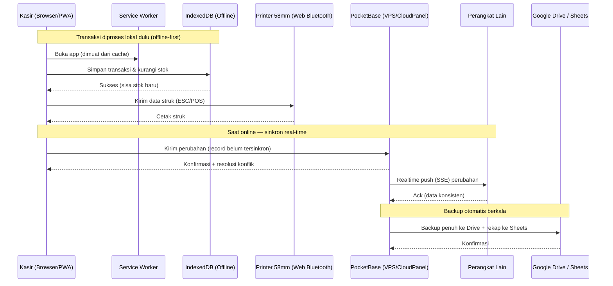
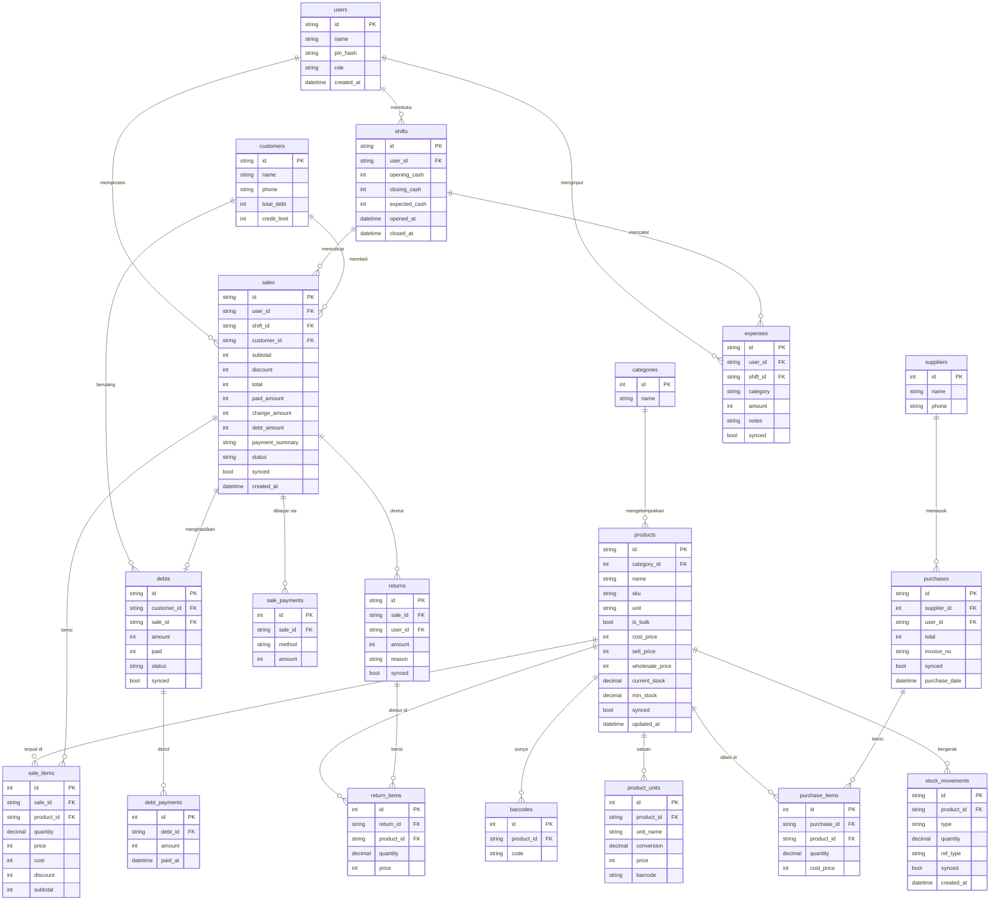

# PRD — Project Requirements Document

**Produk:** Aplikasi Kasir Toko Kelontong (Web / PWA) · **Versi:** 2.1 · **Tanggal:** 10 September 2026

## 1. Overview
Aplikasi ini bertujuan mendigitalkan proses kasir dan pencatatan toko kelontong yang masih manual. Masalah yang diselesaikan: lambatnya transaksi, sulitnya melacak stok real-time, tidak rapihnya pencatatan utang (kasbon), serta tidak adanya gambaran laba dan barang terlaris.

Berbeda dari rencana awal (aplikasi Android), produk ini kini dibuat sebagai **aplikasi web berbasis browser** yang dikemas sebagai **PWA (Progressive Web App)** — dapat dibuka di **komputer/laptop kasir maupun HP/tablet** lewat browser, **"dipasang" ke layar utama** seperti aplikasi biasa, dan tetap **bisa dipakai tanpa internet (offline-first)**. Data tersinkron **real-time antar perangkat** melalui backend **PocketBase** yang berjalan di **VPS pemilik** (dikelola via CloudPanel), dengan **backup otomatis ke Google Drive & laporan ke Google Sheets** saat online. Aplikasi mempercepat transaksi (scan barcode kamera / cari nama / input manual), mengelola stok otomatis, mencatat pembayaran tunai/QRIS/kasbon, mencetak struk, serta menyajikan laporan penjualan, laba, stok, utang, dan kas.

## 2. Requirements
Persyaratan tingkat tinggi:
- **Berbasis web (PWA):** berjalan di browser modern (Chrome/Edge disarankan), **dapat di-install** ke layar utama PC/HP/tablet dan berjalan layaknya aplikasi.
- **Responsif (Wajib):** tata letak menyesuaikan otomatis — **layar lebar (PC/tablet)** memakai dua kolom berdampingan (grid produk + keranjang menetap), **layar sempit (HP)** menjadi satu kolom ringkas. Bukan sekadar tampilan HP yang diregangkan.
- **Offline-first:** transaksi tetap berjalan tanpa internet — data disimpan lokal di browser (**IndexedDB**) via **Service Worker**, lalu **tersinkron otomatis** ke server saat online (real-time antar perangkat).
- **Pengguna & Onboarding:** multi-pengguna, hak akses berbeda — **Pemilik (Admin)** akses penuh, **Kasir** hanya transaksi. Ada **halaman Login** dan **halaman Daftar Akun**. Bila **belum pernah punya akun**, pengguna diarahkan ke **Daftar** untuk membuat akun **Pemilik** (nama toko + nama pemilik + email + sandi, plus PIN). Bila **sudah punya akun**, langsung **Login**. Login/Daftar juga bisa **langsung dengan akun Google** (Sign in with Google — OAuth2 bawaan PocketBase). Aplikasi mulai **bersih (seperti klien baru)** — **tanpa akun dummy atau data demo** apa pun. Pemilik lalu menambahkan kasir. Login harian cepat via **PIN**.
- **Input barang:** **scan barcode** (kamera perangkat, **bisa pindah kamera depan/belakang**), **cari nama/grid produk**, dan **input harga manual**.
- **Barang curah:** penjualan per **berat/jumlah desimal** (mis. 2,5 kg), harga dihitung otomatis.
- **Pembayaran:** tunai (kembalian otomatis), QRIS/transfer (dicatat), **kasbon/utang**, serta **pembayaran campuran & sebagian** (sisa otomatis jadi utang).
- **Struk:** cetak ke **printer thermal Bluetooth 58mm** via **Web Bluetooth**, dengan alternatif cetak biasa/PDF & kirim struk via WhatsApp.
- **Ikon:** memakai **ikon custom (line icon buatan sendiri), tanpa emoji**, tema **modern & simpel** monokrom (dasar putih, aksen abu-abu), mendukung mode gelap.

## 3. Core Features
Fitur kunci, dikelompokkan per tahap rilis.

**Tahap 1 — MVP (Inti Kasir)**
1.  **Dashboard Utama:** ringkasan penjualan & laba hari ini, jumlah transaksi, panel **stok menipis**, indikator status sinkronisasi (tersinkron / menunggu koneksi).
2.  **Transaksi Penjualan (Kasir):** scan barcode (kamera, bisa balik depan/belakang), cari nama/grid, input manual; dukungan **barang curah** (desimal); ubah qty, hapus item, tahan transaksi (hold), diskon per item/transaksi.
3.  **Pembayaran & Struk:** tunai + **kembalian otomatis**; QRIS/transfer; **pembayaran campuran & sebagian** (sisa → utang, wajib pilih pelanggan); cetak **struk thermal 58mm** (Web Bluetooth) atau bagikan struk.
4.  **Manajemen Produk (Master Data):** tambah/edit/hapus produk (nama, barcode—bisa banyak, kategori, satuan, harga beli, harga jual, harga grosir opsional, penanda curah, min stok, stok).
5.  **Manajemen Stok Otomatis:** stok berkurang otomatis saat jual, penyesuaian manual (opname) dengan alasan.
6.  **Daftar, Login & Hak Akses:** **halaman Daftar Akun** (untuk yang belum punya akun → buat akun Pemilik: nama toko + akun + sandi + PIN) dan **halaman Login** (yang sudah punya akun), termasuk **Login/Daftar dengan Google** — **tanpa akun/data dummy**, mulai bersih seperti klien baru; Pemilik menambah kasir; peran Pemilik/Kasir; pencatatan kasir per transaksi.
7.  **PWA, Offline & Sinkron:** dapat di-install, jalan offline, sinkron real-time antar perangkat, **backup otomatis ke Google Drive** & **laporan ke Google Sheets** saat online.
8.  **Laporan Dasar:** penjualan harian/bulanan + estimasi laba.

**Tahap 2 — Operasional Toko**
9.  **Kulakan / Pembelian (Supplier):** catat barang masuk, harga beli, supplier; stok & margin terupdate.
10. **Manajemen Utang (Kasbon):** daftar piutang, cicilan/pelunasan, total piutang, **batas maksimal utang per pelanggan**.
11. **Pelanggan / Member:** data pelanggan langganan & riwayat.
12. **Shift & Tutup Buku:** kas awal, rekap tunai/non-tunai, kas akhir & selisih.
13. **Retur & Pembatalan Transaksi:** stok & uang dikembalikan, tercatat; **otorisasi Pemilik**.
14. **Kas Keluar / Pengeluaran:** catat pengeluaran dari laci (kategori & keterangan).
15. **Satuan Bertingkat (Konversi):** satu produk beberapa satuan (pcs/pak/dus), jual satuan besar memotong stok satuan dasar otomatis.
16. **Laporan Lanjutan:** barang terlaris & slow-moving, laporan stok, utang, rekap kas, **laba bersih** (laba kotor − pengeluaran).

**Tahap 3 — Penyempurnaan**
17. **Kirim struk via WhatsApp** (gambar/teks) selain cetak.
18. **Cetak label barcode sendiri** untuk barang tanpa barcode pabrik.
19. Diskon & promo / harga grosir otomatis, ekspor laporan (PDF/spreadsheet), impor produk massal, multi-cabang (opsional).

## 4. User Flow
1.  **Buka aplikasi:** akses `https://kasir.sayunk.id` di browser (atau ikon PWA yang sudah di-install). App shell dimuat dari cache → langsung siap walau internet lambat.
2.  **Pertama kali (Daftar Akun):** belum punya akun → **halaman Daftar** untuk membuat akun **Pemilik** (nama toko, nama pemilik, email, sandi, PIN) — atau **daftar cepat dengan akun Google**. Aplikasi kosong (klien baru), tidak ada akun/data contoh. Selanjutnya Pemilik dapat menambah kasir.
3.  **Login:** yang sudah punya akun masuk lewat **halaman Login** (email+sandi, **Google**, atau **PIN** untuk masuk cepat Pemilik/Kasir).
3.  **Buka Shift:** kasir memasukkan kas awal (modal laci).
4.  **Setup Produk (Awal):** Pemilik membuat data produk (barcode, harga beli/jual, stok, min stok, penanda curah).
5.  **Transaksi Penjualan:** scan barcode (bisa balik kamera) / cari nama / input manual → keranjang; untuk barang curah masukkan berat/jumlah; ubah qty & diskon → **Bayar**; pilih **Tunai** (uang diterima → kembalian otomatis), **QRIS/Transfer**, atau **Kasbon**, boleh **gabungan**; bila kurang bayar, sisa **otomatis jadi utang** ke pelanggan terpilih; sistem memperbarui stok, menyimpan transaksi & rincian pembayaran, lalu **cetak struk**.
6.  **Kulakan:** saat barang datang, Pemilik input pembelian dari supplier → stok bertambah.
7.  **Bayar Utang:** pelanggan melunasi/cicil kasbon → sisa utang terupdate.
8.  **Tutup Buku:** akhir shift, sistem menampilkan kas seharusnya vs aktual + selisih.
9.  **Monitoring:** Pemilik melihat Dashboard & Laporan.
10. **Sinkron & Backup:** saat online, perubahan tersinkron real-time antar perangkat; data otomatis di-backup ke Google Drive & laporan ke Google Sheets.

## 5. Architecture
Aplikasi adalah **PWA offline-first**. Frontend (app shell) di-cache oleh **Service Worker**; transaksi diproses ke **IndexedDB** lokal agar cepat & jalan tanpa internet, lalu **disinkronkan real-time** ke **PocketBase** di VPS (sumber data bersama antar perangkat), dan di-backup ke Google Drive/Sheets. PocketBase sekaligus **meng-host file statis frontend** (folder `pb_public`), sehingga aplikasi & API berbagi domain `kasir.sayunk.id` (tanpa masalah CORS). CloudPanel menyediakan reverse proxy + SSL.

## 6. Database Schema
ERD struktur data utama (diimplementasikan sebagai **collections PocketBase**; di sisi browser dicerminkan di IndexedDB). Setiap tabel transaksional memiliki `synced` (status sinkron) dan `uuid` (ID aman-perangkat) agar penggabungan offline tidak bentrok.

| Tabel/Collection | Deskripsi |
|-------|-----------|
| **users** | Pengguna (Pemilik/Kasir), PIN, peran. |
| **categories** | Kategori produk. |
| **products** | Master produk: harga beli/jual/grosir, stok (desimal), penanda `is_bulk`, min stok. |
| **barcodes / product_units** | Barcode ganda per produk; satuan bertingkat + konversi ke satuan dasar. |
| **suppliers / purchases / purchase_items** | Data supplier & pembelian (kulakan). |
| **stock_movements** | Log pergerakan stok (masuk/keluar/penyesuaian). |
| **customers** | Pelanggan/member + total & batas utang. |
| **shifts** | Sesi kasir untuk tutup buku. |
| **sales / sale_items / sale_payments** | Transaksi, rincian item, dan rincian pembayaran (mendukung campuran). |
| **returns / return_items** | Retur/pembatalan transaksi. |
| **expenses** | Kas keluar/pengeluaran per shift. |
| **debts / debt_payments** | Utang (kasbon) & pembayarannya. |

## 7. Design & Technical Constraints
Batasan teknis & panduan desain, tanpa mengunci library secara kaku.

1.  **High-Level Technology:**
    Frontend **web modern berbasis komponen** (mis. React/Vue + Vite) yang dikemas sebagai **PWA** (Web App Manifest + Service Worker). State lokal & offline memakai **IndexedDB** (mis. via Dexie). Backend **PocketBase** (database + realtime + auth + admin) berjalan di **VPS pemilik**, dikelola **CloudPanel** (reverse proxy Nginx + SSL). PocketBase juga meng-host file statis PWA di `pb_public` sehingga app & API satu domain (`kasir.sayunk.id`). Prioritas: cepat, andal offline, mudah dipelihara untuk skala kecil–menengah.

2.  **PWA, Offline & Sinkron:**
    - **App shell** di-cache Service Worker → app terbuka instan & bisa offline; dapat **di-install** (Add to Home Screen) di PC/HP/tablet.
    - Data transaksional disimpan di **IndexedDB** dengan status `synced` + `uuid`; **outbox** menampung perubahan yang belum terkirim.
    - **Sinkron real-time** memakai **PocketBase realtime (SSE)**; perubahan satu perangkat langsung didorong ke perangkat lain saat online.
    - **Resolusi konflik stok:** bila dua perangkat offline bersamaan menjual produk sama, semua transaksi tetap tercatat (uang aman); hanya angka stok yang mungkin perlu koreksi — produk ditandai **"stok perlu dicek"**.
    - **Backup otomatis saat online:** backup penuh ke **Google Drive** + rekap ke **Google Sheets** (OAuth Google resmi).

3.  **Hardware & Browser API:**
    - **Scan barcode:** kamera perangkat via `getUserMedia` (toggle kamera **depan/belakang** dengan `facingMode`), pembacaan via **BarcodeDetector API** (fallback pustaka ZXing) — **tanpa perlu install apa pun**.
    - **Cetak struk thermal 58mm:** via **Web Bluetooth** (kirim perintah ESC/POS) di browser pendukung (Chrome Android/desktop); **alternatif** cetak biasa/PDF & kirim struk WhatsApp. *Catatan: Web Bluetooth tidak tersedia di iOS Safari.*

4.  **Keamanan & Autentikasi:**
    Autentikasi via **PocketBase Auth**: email+sandi dan **Google OAuth2** (Sign in with Google) untuk akun Pemilik, serta **PIN** untuk masuk cepat/ganti kasir di perangkat. Google OAuth perlu **OAuth Client di Google Cloud** (redirect URI mengarah ke `https://kasir.sayunk.id`). Data harga beli/margin/laba total hanya untuk Pemilik (API rules PocketBase). Semua trafik lewat **HTTPS**; data milik pemilik di VPS sendiri.

5.  **Design Guidelines (Modern & Simpel):**
    - Gaya **modern, bersih, minimalis**; **tema terang & netral** (dasar putih, **aksen abu-abu**), monokrom, mendukung **mode gelap**.
    - **Ikon custom (line icon buatan sendiri), TANPA emoji**, satu set konsisten.
    - Fokus kecepatan: layar kasir jadi pusat, tombol **Bayar** mudah dijangkau.

6.  **Responsive Layout (Wajib):**
    - **Layar lebar (PC/tablet lanskap):** dua kolom — grid produk di kiri, keranjang & pembayaran menetap di kanan.
    - **Layar sempit (HP):** satu kolom; keranjang/pembayaran sebagai panel/halaman terpisah.
    - Titik pindah tata letak berdasarkan lebar viewport; komponen memakai ukuran relatif; rapi di potret & lanskap.

7.  **Typography Rules:**
    -   **Sans:** `Plus Jakarta Sans, Inter, ui-sans-serif, system-ui, sans-serif`
    -   **Serif:** `serif`
    -   **Mono:** `JetBrains Mono, ui-monospace, monospace`
